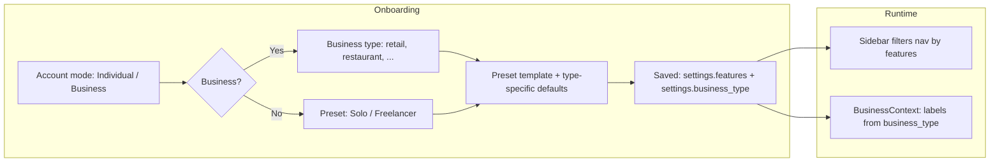

# Features & personas — design sketch

This document sketches how **individuals** and **businesses** (with **business type**) choose **which product areas appear**, without breaking existing `settings.business_type` behavior.

## 1. Two independent dimensions

| Dimension | Purpose | Where it lives (today / proposed) |
|-----------|---------|-----------------------------------|
| **Account mode** | *Who* is using the app: solo vs org | Proposed: `user.settings.account_mode` → `individual` \| `business` |
| **Business type** | *Industry* flavor: retail, restaurant, salon, … | Already: `user.settings.business_type` (and `getBusinessType()` on web) |
| **Feature modules** | *What* surfaces in the app | Proposed: `user.settings.features` (object of booleans or string[]) |

**Rule:** `business_type` only applies when `account_mode === "business"` (or is ignored for copy presets if you allow “freelancer with retail-like shop”). **Individuals** still get a **minimal default bundle** and can turn modules on.

## 2. Feature modules (stable keys)

Keys should map 1:1 to **sidebar sections or routes** so gating is predictable.

**Suggested keys** (extend as needed):

| Key | Routes / area | Typical individual | Typical business |
|-----|----------------|----------------------|------------------|
| `messages` | Messages, threads | ✓ | ✓ |
| `contacts_crm` | Customers, Contacts | optional | ✓ |
| `sales` | Sales, Orders, Payments | optional | ✓ |
| `bookings` | Bookings / Reservations | — | depends on type |
| `shop` | Shop / Menu / Catalog | optional | ✓ |
| `marketing` | Broadcast, Automations | optional | ✓ |
| `team` | Team, Team analytics | — | ✓ |
| `integrations` | WhatsApp, channels | ✓ | ✓ |
| `analytics` | Analytics | — | ✓ |
| `suppliers` | Suppliers | — | retail / F&B |
| `assistant` | Zilo Chat | ✓ | ✓ |
| `imports` | Imports | — | ✓ |

**Note:** Today, **bookings visibility** is partly driven by `business_type` in `BusinessContext` (`showBookingsNav`). The sketch keeps that as **defaults**, then lets **explicit `features.bookings`** override for power users.

## 3. Presets (reduce toggle fatigue)

On **signup** or first login, user picks **one** preset; we expand it into `settings.features` + set `account_mode` / `business_type` as needed.

| Preset ID | account_mode | business_type (if business) | Idea |
|-----------|--------------|-----------------------------|------|
| `solo_messaging` | individual | — | Messages + Integrations + Assistant |
| `freelancer_light` | individual | `creator` or `general` | Above + Contacts + light Marketing |
| `small_business` | business | user picks type | Balanced retail/service bundle |
| `full_crm` | business | user picks type | All modules on (respect type for bookings/KDS labels) |

**Business type** (retail, restaurant, salon, …) then **adjusts labels and defaults** via existing `getWebBusinessUi()` — not a second “feature picker” for the same thing.



## 4. Data model (backend)

Store on **user** document (same place as `settings.business_type`):

```json
{
  "settings": {
    "business_type": "retail",
    "account_mode": "business",
    "features": {
      "messages": true,
      "contacts_crm": true,
      "sales": true,
      "bookings": true,
      "shop": true,
      "marketing": true,
      "team": true,
      "integrations": true,
      "analytics": true,
      "suppliers": false,
      "assistant": true,
      "imports": true
    },
    "features_version": 1
  }
}
```

- **`GET /api/me`** (or existing user payload) should return `settings.features` so the web app can cache in `localStorage` user blob or refetch via `BusinessProvider.refreshSettings()`.
- **`PATCH /api/users/me/settings`** (or extend existing settings endpoint) to update `features` partially.

**Merge rule:** Missing keys = **default true** for backward compatibility, or default from **preset** once we introduce `features_version`.

## 5. UI: “Features” tab (settings)

**Layout sketch:**

1. **Summary line:** Account mode + business type (read-only or change with warning).
2. **Quick presets:** Cards *Solo* | *Small business* | *Full* — applying a preset **overwrites** `features` (confirm dialog).
3. **Customize:** Grouped toggles (not a literal slider unless you mean *carousel* for marketing):
   - **Conversations:** Messages, Assistant  
   - **CRM:** Customers & contacts  
   - **Revenue:** Sales, Orders, Payments, Shop  
   - **Ops:** Bookings, Suppliers, Imports  
   - **Growth:** Broadcast, Automations  
   - **Org:** Team, Analytics, Integrations  

**“Slider” clarification:** Use **toggles** for on/off. Reserve a **carousel** only for onboarding (“Explore modules”) if you want discovery; avoid sliders for binary features.

## 6. Sidebar integration (web)

Today `Sidebar.tsx` builds `NAV_GROUPS` statically. **Target behavior:**

1. Build the same structure as now (preserving `useBusiness()` for labels and bookings href).
2. **Filter** each item with `features[key] !== false` (or a small map `href → featureKey`).
3. Hide entire **groups** when all items in the group are hidden.

Pseudo:

```ts
function navItemAllowed(href: string, features: FeaturesMap): boolean {
  const key = HREF_TO_FEATURE[href];
  if (!key) return true;
  return features[key] !== false;
}
```

Centralize `HREF_TO_FEATURE` next to `MAIN_NAV` / `BUSINESS_NAV_BASE` so it stays maintainable.

## 7. Relation to existing `businessUi`

- **`business_type`** continues to drive **copy** (Customers vs Clients, Shop vs Menu, KDS, bookings label).
- **`features`** drives **visibility** of whole areas.
- Example: `business_type === "retaurant"` and `features.shop === true` → show “Menu”; if `features.shop === false`, hide shop regardless of type.

## 8. Implementation phases

| Phase | Scope |
|-------|--------|
| **1** | Add `account_mode` + `features` to user model & API; default all `true` for existing users. |
| **2** | Features settings page + persist; wire `Sidebar` filter from `getUser().settings.features`. |
| **3** | Onboarding preset selection → write `features` + `business_type`. |
| **4** | Optional: enforce on backend (reject API calls for disabled modules) — security, not just UI. |

---

*This sketch aligns with `CRM/web/contexts/BusinessContext.tsx`, `lib/businessUi.ts`, and `components/Sidebar.tsx` as of the sketch date.*
